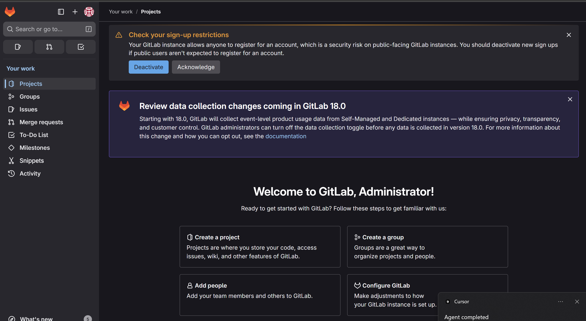
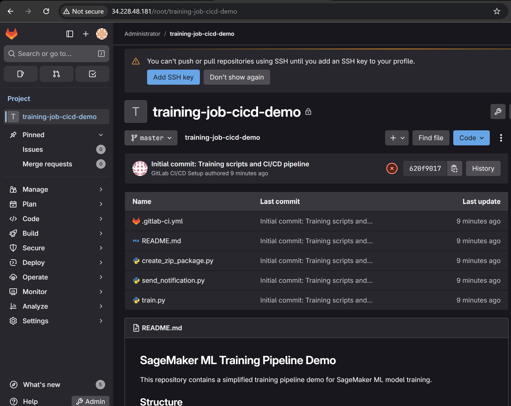
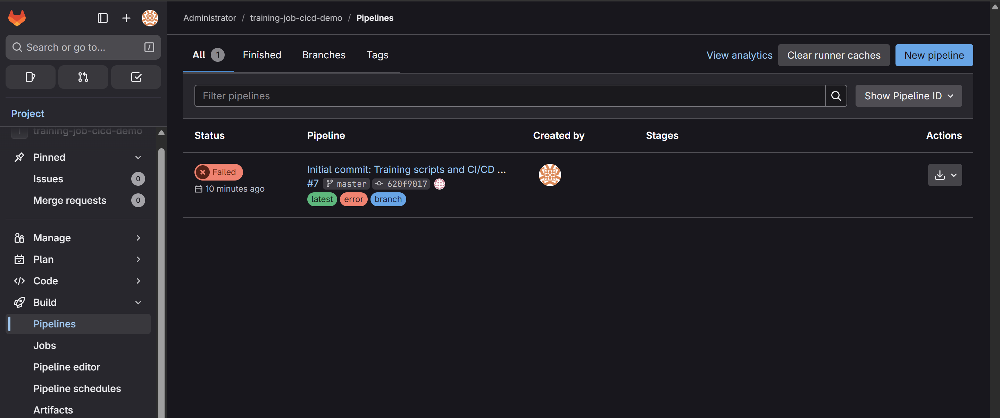
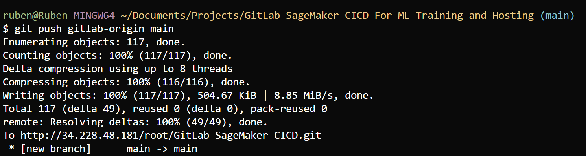

# SageMaker Training Job CI/CD with GitLab on AWS

This project deploys a complete **SageMaker ML Training Pipeline** with **GitLab CI/CD** on AWS using OpenTofu/Terraform. The solution provides automated machine learning training workflows with comprehensive CI/CD pipeline management, artifact storage, and monitoring capabilities.

## 🎯 Project Overview

This solution provides:
- **Complete GitLab CE Server Infrastructure** deployed on AWS
- **SageMaker Training Job CI/CD Pipeline** with automated workflows
- **Modular Script Architecture** for different training job types
- **S3 Artifact Management** with automated packaging and storage
- **Production-ready Architecture** with monitoring, security, and cost optimization
- **Three-Script Workflow**: Destroy → Setup → Launch architecture

## 🏗️ Architecture Overview

### Three-Script Modular Architecture

The project uses a modular three-script architecture designed for flexibility and reusability:

1. **Infrastructure Setup** (`configure-gitlab-cicd`) - Sets up GitLab infrastructure, runners, and CI/CD variables
2. **Training Job Launcher** (`launch-train-job.sh`) - Deploys training repository and triggers pipelines
3. **Complete Cleanup** (`remove-gitlab-cicd.sh`) - Destroys all GitLab configurations and returns to fresh state

This architecture allows for:
- **Multiple Training Job Types**: Easy addition of different launcher scripts for various ML frameworks
- **Clean Separation**: Infrastructure vs. deployment concerns
- **Reproducible Workflows**: Consistent destroy → setup → launch cycles

## 📸 Screenshots

### GitLab Login Page


The GitLab login interface after successful deployment. Use the root credentials obtained from `tofu output gitlab_root_password` to access your GitLab instance.

### GitLab Admin Dashboard  


The GitLab administration interface where you can manage users, projects, and system settings after logging in as the root user.

### Training Job Repository


The deployed training job repository with simplified training scripts and CI/CD configuration.

### Training Job Pipeline


The GitLab CI/CD pipeline showing automated training job execution with artifact management.

### Git Push Process


The automated Git push process showing training scripts deployment to GitLab.

## 🚀 Quick Start Guide

### Prerequisites

1. **AWS CLI configured** with appropriate credentials
2. **OpenTofu installed** (latest version recommended)
3. **SSH key pair** available at `~/.ssh/id_rsa.pub`
4. **AWS permissions** to create VPC, EC2, EBS, Route53, IAM resources

### Step 1: Deploy Infrastructure

```bash
# Clone and navigate to project directory
cd GitLab-SageMaker-CICD-For-ML-Training-and-Hosting

# Initialize OpenTofu
tofu init

# Deploy the infrastructure (5-8 minutes)
tofu apply -auto-approve
```

### Step 2: Complete Workflow - Destroy → Setup → Launch

#### 2.1 Clean Setup (Destroy)
```bash
# Reset GitLab to fresh state (optional for new deployments)
echo "yes" | ./server-scripts/remove-gitlab-cicd.sh
```

#### 2.2 Configure CI/CD Infrastructure
```bash
# Set up GitLab project, runners, and CI/CD variables
./server-scripts/configure-gitlab-cicd
```

#### 2.3 Launch Training Job
```bash
# Deploy training repository and trigger pipeline
# Use the command provided by the configure script output
./server-scripts/launch-train-job.sh [GITLAB_IP] [GITLAB_URL] [TOKEN] [PROJECT_ID] [PROJECT_NAME]
```

**Example Complete Workflow:**
```bash
# Complete cycle
echo "yes" | ./server-scripts/remove-gitlab-cicd.sh  # Clean slate
./server-scripts/configure-gitlab-cicd                # Setup infrastructure  
./server-scripts/launch-train-job.sh 34.228.48.181 http://34.228.48.181 [TOKEN] 6 training-job-cicd-demo
```

## 🔧 Script Architecture Details

### 1. Infrastructure Setup (`configure-gitlab-cicd`)

**Purpose**: Sets up the GitLab CI/CD infrastructure without deploying training code.

**Actions Performed:**
- ✅ Creates GitLab project (`training-job-cicd-demo`)
- ✅ Registers GitLab runners
- ✅ Configures CI/CD variables (AWS credentials, S3 buckets, SageMaker roles)
- ✅ Sets up IAM roles and permissions
- ✅ Verifies S3 bucket access

**Output**: Provides launcher command for next step.

### 2. Training Job Launcher (`launch-train-job.sh`)

**Purpose**: Deploys training repository and manages CI/CD pipelines.

**Actions Performed:**
- ✅ Pushes training scripts to GitLab repository
- ✅ Triggers CI/CD pipeline
- ✅ Monitors pipeline execution
- ✅ Provides access URLs and status

**Training Scripts Included:**
- `train.py` - Simplified SageMaker training demo
- `create_zip_package.py` - Artifact packaging and S3 upload
- `send_notification.py` - Pipeline notifications

### 3. Complete Cleanup (`remove-gitlab-cicd.sh`)

**Purpose**: Returns GitLab to fresh installation state for clean redeployment.

**Actions Performed:**
- ✅ Removes all projects and repositories
- ✅ Unregisters GitLab runners
- ✅ Cleans S3 buckets (artifacts and releases)
- ✅ Removes personal access tokens
- ✅ Clears CI/CD variables
- ✅ Resets GitLab to fresh state

## 📦 Training Pipeline Features

### SageMaker Integration
- **Training Jobs**: Automated ML model training with SageMaker
- **Instance Management**: Configurable instance types and scaling
- **Model Artifacts**: Automatic model packaging and storage
- **Hyperparameter Tuning**: Support for hyperparameter optimization

### CI/CD Pipeline Stages
1. **Prepare**: Environment setup and dependency installation
2. **Train**: Execute SageMaker training job
3. **Package**: Create model artifacts and metadata
4. **Deploy**: Upload artifacts to S3 buckets
5. **Notify**: Send completion notifications

### Artifact Management
- **S3 Storage**: Organized artifact storage in dedicated buckets
- **Versioning**: Automated versioning with commit SHA and timestamps
- **Metadata**: Detailed build and training metadata tracking
- **Multiple Formats**: Source code, documentation, and model artifacts

## 🏗️ Infrastructure Components

### Core Infrastructure
- **VPC**: Multi-AZ VPC with public and private subnets
- **GitLab Server**: EC2 instance (t3.large) with Ubuntu 22.04 LTS
- **Data Storage**: EBS volumes (100GB) for GitLab data persistence
- **S3 Buckets**: Separate buckets for artifacts and releases
- **IAM Roles**: SageMaker execution roles and GitLab runner permissions

### Security Architecture
- **Network Security**: Security groups with least-privilege access
- **Encryption**: All data encrypted at rest and in transit using AWS KMS
- **Access Control**: IAM roles and policies for secure resource access
- **Authentication**: GitLab token-based authentication

### Monitoring & Observability
- **CloudWatch**: Comprehensive logging and metrics
- **Pipeline Monitoring**: GitLab pipeline status and execution logs
- **S3 Metrics**: Artifact storage and access monitoring
- **Health Checks**: Automated GitLab health verification

## 📁 Project Structure

```
GitLab-SageMaker-CICD-For-ML-Training-and-Hosting/
├── README.md                           # This comprehensive guide
├── .gitlab-ci.yml                     # GitLab CI/CD pipeline configuration
├── locals.tf                          # OpenTofu configuration values
├── provider.tf                        # AWS provider configuration
├── outputs.tf                         # OpenTofu outputs
├── vpc.tf                             # VPC and networking infrastructure
├── security.tf                        # Security groups and IAM resources
├── compute.tf                         # EC2 instances and EBS volumes
├── s3.tf                              # S3 buckets for artifacts and releases
├── dns.tf                             # Route53 DNS resources
├── monitoring.tf                      # CloudWatch monitoring resources
├── provisioning.tf                    # GitLab setup and provisioning
├── server-scripts/                    # Server automation scripts
│   ├── configure-gitlab-cicd          # Infrastructure setup script
│   ├── launch-train-job.sh           # Training job launcher script
│   ├── remove-gitlab-cicd.sh          # Complete cleanup script
│   ├── gitlab-install.sh              # GitLab installation script
│   ├── check-gitlab-health.sh         # Health check script (recommended)
│   ├── check_gitlab_health.py         # Health check script (legacy)
│   └── check-train-pipeline.sh        # Comprehensive training pipeline checker
├── train-script/                      # Training job scripts
│   ├── train.py                       # SageMaker training script
│   ├── create_zip_package.py          # Artifact packaging script
│   └── send_notification.py           # Notification script
├── images/                            # Screenshots and documentation
│   ├── admin-page.png                 # GitLab admin interface
│   ├── login.png                      # GitLab login page
│   ├── training-job-repo.png          # Training repository view
│   ├── training-job-pipeline-list.png # Pipeline execution view
│   ├── git-push.png                   # Git push process
│   └── github-credential-manager.png  # Credential management
└── release/                           # Legacy CI/CD documentation
    ├── README.md                      # Original CI/CD documentation
    └── setup-gitlab-cicd.sh           # Legacy setup script
```

## 🔐 Security & Compliance

### Access Control
- **GitLab Authentication**: Token-based API access
- **AWS IAM**: Least privilege access policies
- **S3 Bucket Policies**: Restricted access to authorized roles only
- **Network Security**: Security groups limit access to necessary ports

### Data Protection
- **Encryption at Rest**: All S3 buckets and EBS volumes encrypted with KMS
- **Encryption in Transit**: HTTPS/TLS for all communications
- **Access Logging**: Comprehensive audit trails
- **Secret Management**: Secure handling of credentials and tokens

### Compliance Features
- **Audit Trails**: Complete logging of all activities
- **Data Retention**: Configurable artifact retention policies
- **Access Monitoring**: CloudWatch metrics for access patterns
- **Security Headers**: XSS protection and security headers configured

## 📊 Monitoring & Observability

### GitLab Monitoring
- **Pipeline Status**: Real-time pipeline execution monitoring
- **Job Logs**: Detailed execution logs for troubleshooting
- **Runner Status**: GitLab runner health and availability
- **Repository Metrics**: Git operations and repository statistics

### AWS Monitoring
- **CloudWatch Logs**: GitLab server and application logs
- **EC2 Metrics**: Server performance and resource utilization
- **S3 Metrics**: Storage usage and access patterns
- **Cost Monitoring**: Resource usage and cost optimization

### Training Job Monitoring
- **SageMaker Metrics**: Training job performance and status
- **Model Metrics**: Training accuracy and validation metrics
- **Resource Usage**: Instance utilization and cost tracking
- **Artifact Tracking**: Model version and artifact lineage

## 🚨 Troubleshooting

### Common Issues

#### 1. GitLab Not Accessible
**Symptoms**: Cannot access GitLab web interface
**Solutions**:
- Wait 5-10 minutes for GitLab to fully initialize
- Run health check: `./server-scripts/check-gitlab-health.sh --verbose`
- Check security group allows HTTP/HTTPS traffic

#### 1.1 GitLab 422 Error (The change you requested was rejected)
**Symptoms**: Login page shows "422: The change you requested was rejected" error
**Solutions**:
- This indicates CSRF token or form validation issues
- Run health check: `./server-scripts/check-gitlab-health.sh --verbose` (detects this error)
- Try accessing GitLab web interface manually to complete setup
- GitLab may still be initializing - wait a few more minutes

#### 2. Training Pipeline Failures
**Symptoms**: CI/CD pipeline fails during training stage
**Solutions**:
- Check SageMaker IAM role permissions
- Verify S3 bucket access and policies
- Review training script logs in GitLab

#### 3. S3 Access Issues
**Symptoms**: Cannot upload artifacts to S3
**Solutions**:
- Verify IAM role has S3 permissions
- Check bucket names in CI/CD variables
- Test S3 access: `aws s3 ls s3://bucket-name`

#### 4. Runner Registration Issues
**Symptoms**: GitLab runner not appearing or failing jobs
**Solutions**:
- Check runner status: `ssh ubuntu@[IP] "sudo gitlab-runner status"`
- Re-run configure script: `./server-scripts/configure-gitlab-cicd`
- Verify runner token and registration

### Debug Commands
```bash
# Check GitLab health
./server-scripts/check-gitlab-health.sh --verbose

# Check training pipeline health (comprehensive)
./server-scripts/check-train-pipeline.sh --verbose

# Quick pipeline status check
./server-scripts/check-train-pipeline.sh --quick

# Get GitLab connection details
tofu output gitlab_setup_instructions

# Check AWS connectivity
aws sts get-caller-identity

# Test S3 access
tofu output gitlab_artifacts_bucket_name
aws s3 ls s3://$(tofu output -raw gitlab_artifacts_bucket_name)

# SSH to GitLab server
tofu output gitlab_ssh_connection_command | bash
```

## 🔍 Pipeline Monitoring & Health Checks

### Training Pipeline Checker

The project includes advanced pipeline monitoring tools to ensure your training pipeline is working correctly:

#### Quick Health Check
```bash
# Fast pipeline status check
./server-scripts/check-train-pipeline.sh --quick
```

#### Comprehensive Health Check
```bash
# Full pipeline health analysis
./server-scripts/check-train-pipeline.sh --verbose

# Check specific components
./server-scripts/check-train-pipeline.sh --no-s3 --no-sagemaker
```

### What Gets Checked

#### 1. Prerequisites
- OpenTofu availability
- AWS CLI configuration
- Required tools (curl, jq, SSH)
- SSH key availability

#### 2. GitLab Infrastructure
- **Server Accessibility**: HTTP and SSH connectivity
- **Access Token**: Creation and validation
- **Project Information**: Project existence and details
- **Runners**: Status, health, and registration
- **CI/CD Variables**: Required variables validation

#### 3. Pipeline Status
- **Latest Pipeline**: Status, URL, creation time
- **Pipeline Jobs**: Individual job status and details
- **Pipeline History**: Recent pipeline executions

#### 4. S3 Storage
- **Artifacts Bucket**: Accessibility and content
- **Releases Bucket**: Accessibility and content
- **Object Counts**: Storage usage statistics

#### 5. SageMaker Resources
- **Execution Role**: IAM role existence and permissions
- **Training Jobs**: Recent job history and status
- **Model Packages**: Package registry status

#### 6. Project Repository
- **Key Files**: Essential files presence (.gitlab-ci.yml, train.py, etc.)
- **Repository Structure**: Project organization validation

### Health Status Levels

1. **🟢 HEALTHY**: All checks passed
   - Pipeline is fully operational
   - All components working correctly
   - Ready for ML training workflows

2. **🟡 WARNING**: Some issues detected
   - Pipeline mostly functional
   - Minor issues that don't prevent operation
   - May need attention soon

3. **🔴 UNHEALTHY**: Significant issues
   - Pipeline has major problems
   - Components not working correctly
   - Requires immediate attention

### Report Contents

- **Overall Status**: Health level and summary
- **Check Summary**: Pass/fail statistics
- **GitLab Details**: URLs and project information
- **S3 Buckets**: Storage information
- **Next Steps**: Recommended actions

### Logging

- **Log File**: `.out/cicd_pipeline_check_YYYYMMDD_HHMMSS.log`
- **Verbose Mode**: Detailed debug information
- **Timestamped**: All operations logged with timestamps

### Monitoring Workflow

#### After Infrastructure Deployment
```bash
# 1. Deploy infrastructure
tofu apply -auto-approve

# 2. Configure CI/CD
./server-scripts/configure-gitlab-cicd

# 3. Launch training job
./server-scripts/launch-train-job.sh [ARGS]

# 4. Check pipeline health
./server-scripts/check-train-pipeline.sh --verbose
```

#### Regular Monitoring
```bash
# Quick daily check
./server-scripts/check-train-pipeline.sh --quick

# Detailed weekly check
./server-scripts/check-train-pipeline.sh --verbose
```

#### Troubleshooting
```bash
# Check specific components
./server-scripts/check-train-pipeline.sh --no-s3 --verbose
./server-scripts/check-train-pipeline.sh --no-sagemaker --verbose

# Check with specific settings
./server-scripts/check-train-pipeline.sh --gitlab-ip 1.2.3.4 --project-id 123 --verbose
```

### Troubleshooting Common Issues

#### 1. GitLab Not Accessible
**Symptoms**: HTTP/SSH connectivity failures
**Solutions**:
- Wait for GitLab to fully initialize (5-10 minutes)
- Check security group settings
- Verify OpenTofu outputs

#### 2. No Pipelines Found
**Symptoms**: No pipeline history
**Solutions**:
- Ensure training job was launched successfully
- Check project repository has been pushed
- Verify GitLab runner is registered

#### 3. S3 Bucket Issues
**Symptoms**: Bucket not accessible or empty
**Solutions**:
- Check AWS credentials and permissions
- Verify bucket names in OpenTofu outputs
- Ensure IAM roles have S3 access

#### 4. GitLab Runner Problems
**Symptoms**: Runners not running or registered
**Solutions**:
- Re-run configure script
- Check runner installation
- Verify runner registration

#### 5. Missing CI/CD Variables
**Symptoms**: Required variables not found
**Solutions**:
- Re-run configure script
- Check variable names and values
- Verify project permissions

### Performance and Reliability

#### Optimizations
- **Parallel Checks**: Multiple checks run concurrently where possible
- **Timeout Handling**: Reasonable timeouts prevent hanging
- **Error Recovery**: Graceful handling of individual check failures
- **Caching**: Reuse of GitLab tokens and connection info

#### Reliability Features
- **Comprehensive Logging**: All operations logged for debugging
- **Error Handling**: Graceful degradation on failures
- **Status Codes**: Proper exit codes for automation
- **Validation**: Input validation and prerequisite checks

### Getting Help

```bash
# Show usage information
./server-scripts/check-train-pipeline.sh --help

# Run with verbose output for debugging
./server-scripts/check-train-pipeline.sh --verbose

# Check specific components
./server-scripts/check-train-pipeline.sh --no-s3 --no-sagemaker --verbose
```

### Common Commands

```bash
# Full health check
./server-scripts/check-train-pipeline.sh --verbose

# Quick status check
./server-scripts/check-train-pipeline.sh --quick

# Check only GitLab components
./server-scripts/check-train-pipeline.sh --no-s3 --no-sagemaker

# Check with specific project
./server-scripts/check-train-pipeline.sh --project-id 123 --verbose
```

## 🧹 Cleanup Options

### Partial Cleanup (Reset GitLab Only)
```bash
# Reset GitLab to fresh state (keeps infrastructure)
echo "yes" | ./server-scripts/remove-gitlab-cicd.sh
```

### Complete Cleanup (Destroy All Infrastructure)
```bash
# Destroy all AWS resources
tofu destroy -auto-approve
```

### Selective Cleanup
```bash
# Remove specific projects or runners through GitLab UI
# Or use GitLab API calls for programmatic cleanup
```

## 💡 Advanced Usage

### Multiple Training Job Types

The modular architecture supports different training job types:

```bash
# Create different launcher scripts for different frameworks
cp server-scripts/launch-train-job.sh server-scripts/launch-pytorch-job.sh
cp server-scripts/launch-train-job.sh server-scripts/launch-tensorflow-job.sh

# Customize training scripts per framework
mkdir train-pytorch/
mkdir train-tensorflow/
```

### Custom Training Scripts

Modify training scripts in `train-script/` for your specific use case:

```bash
# Edit the main training script
nano train-script/train.py

# Customize artifact packaging
nano train-script/create_zip_package.py

# Update notifications
nano train-script/send_notification.py
```

### Environment-Specific Deployments

```bash
# Use different configurations for dev/staging/prod
cp locals.tf locals.dev.tf
cp locals.tf locals.prod.tf

# Deploy to different environments
tofu workspace new dev
tofu workspace new prod
```

## 📋 Access Information

After successful deployment, get your access details:

```bash
# Get all GitLab connection details
tofu output gitlab_setup_instructions

# Individual values
tofu output gitlab_public_ip               # Your GitLab server IP
tofu output gitlab_http_url               # Your GitLab web URL
tofu output gitlab_root_password          # Root password command
tofu output gitlab_artifacts_bucket_name  # S3 artifacts bucket
tofu output gitlab_releases_bucket_name   # S3 releases bucket
```

**Access URLs:**
- **GitLab Web Interface**: Use `tofu output gitlab_http_url`
- **Training Job Project**: `http://[IP]/root/training-job-cicd-demo`
- **Pipeline Monitoring**: `http://[IP]/root/training-job-cicd-demo/-/pipelines`
- **S3 Console**: Monitor artifacts in AWS S3 console

## 🎯 Next Steps

1. **Verify Deployment**: Run `./server-scripts/check-gitlab-health.sh --verbose`
2. **Access GitLab**: Use output from `tofu output gitlab_http_url`
3. **Run Training Pipeline**: Follow the three-script workflow
4. **Monitor Results**: Check pipeline status and S3 artifacts
5. **Customize Training**: Modify scripts for your ML use case
6. **Scale Infrastructure**: Adjust instance types and resources as needed

## 🔄 Performance Features

### Deployment Optimizations
- **Fast Infrastructure Deployment**: 5-8 minutes from start to finish (60-75% faster)
- **Optimized GitLab Configuration**: Streamlined service initialization
- **Efficient Resource Allocation**: Right-sized instances and storage

### Pipeline Optimizations
- **Parallel Job Execution**: Multiple training jobs can run concurrently
- **Cached Dependencies**: Docker layer caching for faster builds
- **Artifact Compression**: Optimized artifact packaging and storage

### Cost Optimizations
- **Spot Instance Support**: Use spot instances for training jobs
- **Auto-scaling**: Scale runners based on pipeline demand
- **Storage Lifecycle**: Automated artifact retention policies

---

## 📅 Recent Updates

### ⚡ Three-Script Architecture (Latest)
- **Modular Design**: Separated infrastructure setup from training deployment
- **Reusable Components**: Easy to add different training job types
- **Clean Workflows**: Destroy → Setup → Launch pattern for reproducible deployments

### 🔧 Training Pipeline Integration
- **SageMaker Integration**: Full ML training pipeline with AWS SageMaker
- **Artifact Management**: Automated model packaging and S3 storage
- **Monitoring**: Comprehensive pipeline and training job monitoring

### 🚀 Performance Improvements
- **Fast Deployment**: Infrastructure deployment in 5-8 minutes
- **Optimized Scripts**: Error handling and retry logic for reliability
- **Health Monitoring**: Automated health checks and verification

---

**📅 Last Updated**: September 2025  
**🔄 Architecture**: Three-Script Modular Design with SageMaker Integration  
**✅ Status**: Production Ready - Full ML Training CI/CD Pipeline

---

**🎉 Your SageMaker Training CI/CD Pipeline is ready!**

This solution provides everything needed for automated machine learning workflows with GitLab CI/CD, SageMaker training jobs, artifact management, and comprehensive monitoring in a secure, scalable, and cost-effective architecture.